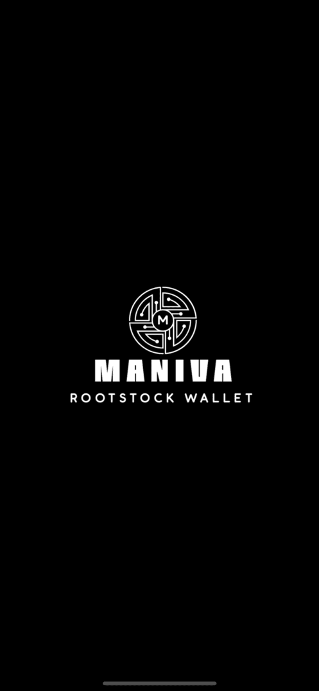
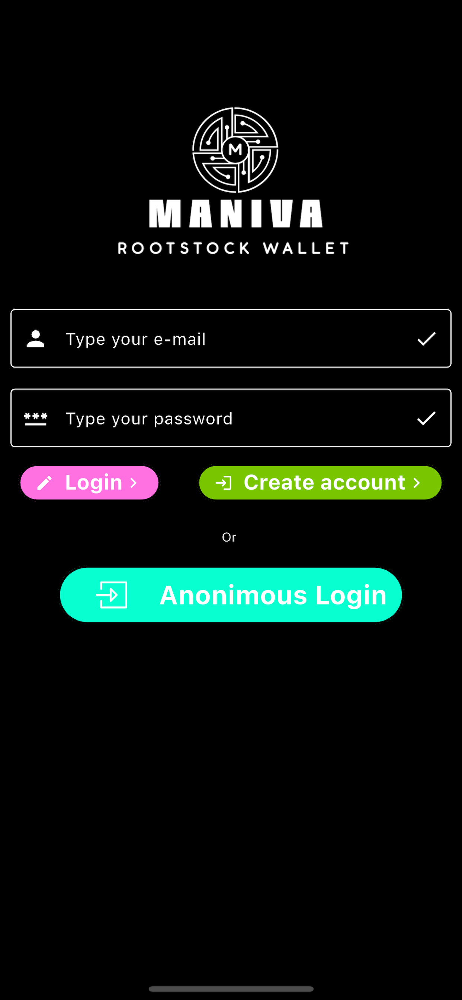
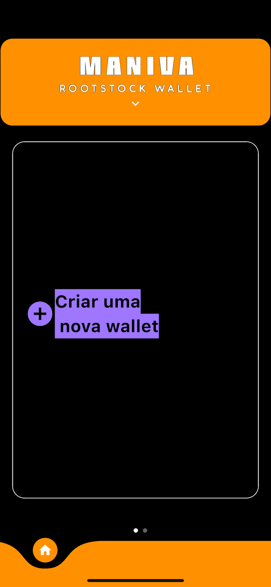
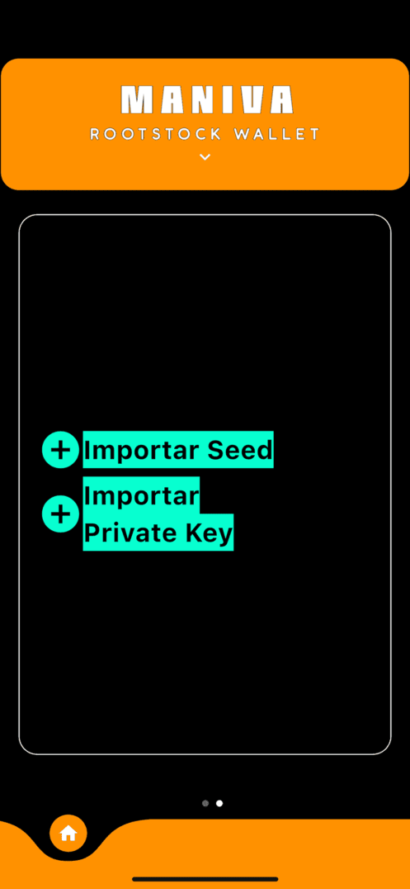
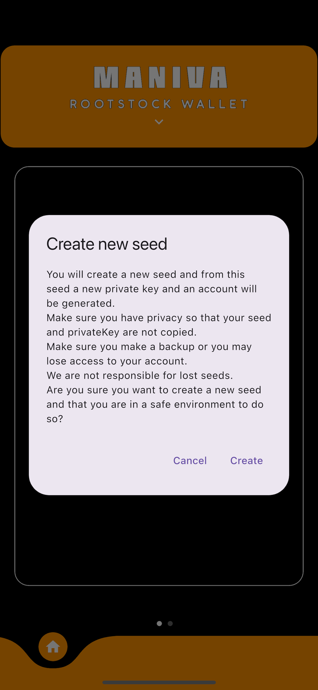
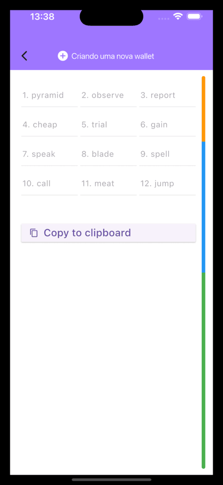
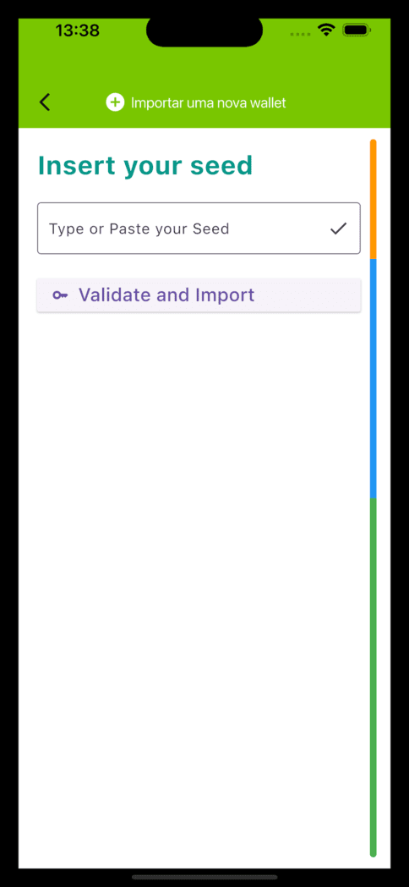
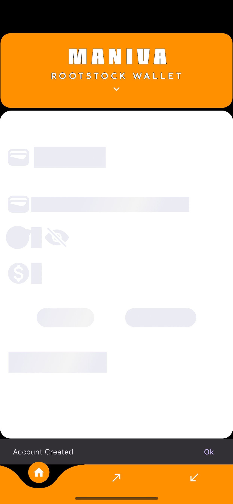
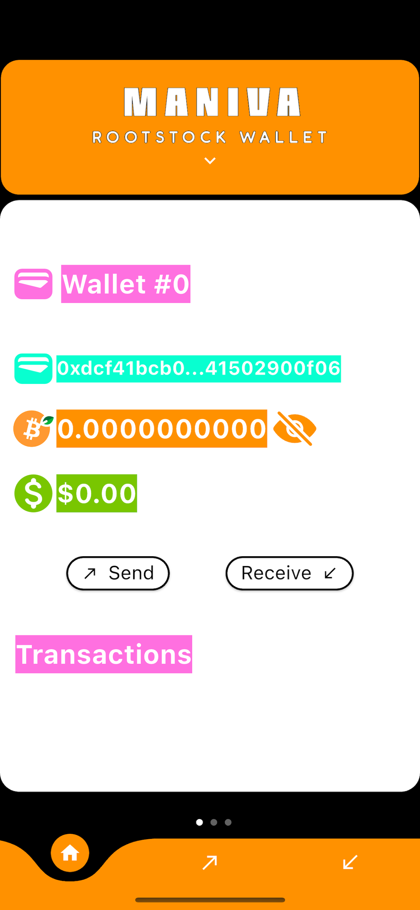

# Maniva Wallet

[](https://scorecard.dev/viewer/?uri=github.com/financial-bjbraz/maniva_wallet)

An open-source, multi-platform Flutter wallet supporting **Bitcoin** (BTC / testnet3) and **Rootstock** (RBTC + ERC20 tokens). A single private key produces both a Bitcoin address and an RSK/EVM address, enabling native PowPeg BTC↔RBTC bridge compatibility.

> **Unofficial wallet** — not affiliated with or endorsed by Rootstock/IOVlabs.

[Releases](https://github.com/financial-bjbraz/maniva_wallet/releases/latest)

---

## Screenshots











---

## Features

- **Bitcoin** — send and receive BTC on mainnet and testnet3; UTXO-based, offline signing via `dartsv`
- **Rootstock** — send and receive RBTC and ERC20 tokens via `web3dart`
- **Supported tokens**: RBTC, RIF, USDRIF, DOC, RIFPRO, tBRZ (testnet counterparts available)
- **PowPeg bridge** — single private key derives consistent BTC and RSK addresses for BTC↔RBTC bridge use
- **Multi-platform**: iOS, Android, macOS, Linux, web
- **Localization**: English, Portuguese, Spanish

---

## Architecture

### Bitcoin — dual-source design

Bitcoin operations are intentionally split across two backends. Do not merge them back into a single source:

| Operation | Backend | Why |
|-----------|---------|-----|
| UTXO discovery + balance | Esplora REST (`BITCOIN_ESPLORA_URL`) | Public nodes reject wallet-loaded RPC methods (`listunspent`, `scantxoutset`) |
| Fee estimation + broadcast | Bitcoin Core JSON-RPC (`BITCOIN_NODE`) | `estimatesmartfee` and `sendrawtransaction` work on public nodes |
| Transaction signing | Offline, client-side via `dartsv` | Never routed through RPC |

### Single-key dual-chain

One private key generates both the Bitcoin address/WIF and the RSK/EVM address. This is required for [PowPeg](https://dev.rootstock.io/rsk/architecture/powpeg/) BTC↔RBTC bridge compatibility — the bridge depends on the same key pair producing consistent addresses on both networks.

---

## Getting Started

### Prerequisites

- Flutter SDK ≥ 3.5.0 — [install guide](https://docs.flutter.dev/get-started/install)
- For iOS/macOS: Xcode + CocoaPods (`brew install cocoapods`)

### 1. Clone and install dependencies

```bash
git clone https://github.com/financial-bjbraz/maniva_wallet.git
cd maniva_wallet
flutter pub get
```

### 2. Configure environment

```bash
cp .env.example .env
```

Edit `.env` and fill in your node endpoints:

| Variable | Description |
|----------|-------------|
| `ROOTSTOCK_NODE` | Rootstock/RSK JSON-RPC endpoint (testnet) |
| `BITCOIN_NODE` | Bitcoin Core JSON-RPC endpoint — for fee estimation and broadcast only (testnet) |
| `BITCOIN_ESPLORA_URL` | Esplora REST endpoint for UTXO/balance (testnet default: `https://mempool.space/testnet/api`) |
| `ROOTSTOCK_NODE_MAIN` | Mainnet RSK RPC endpoint (required to enable mainnet mode) |
| `BITCOIN_NODE_MAIN` | Mainnet Bitcoin Core JSON-RPC endpoint — for fee estimation and broadcast |
| `BITCOIN_ESPLORA_URL_MAIN` | Mainnet Esplora REST endpoint for UTXO/balance (recommended for mainnet mode) |
| `TOKENS_MAIN` | Mainnet ERC20 token contract addresses (required to enable mainnet mode) |

> ⚠️ **Security**: `.env` is bundled into the app binary via Flutter assets. Never put a funded private key or production secrets in this file — anyone who unpacks the app binary can read it. The `PRIVATE_KEY` field in `.env` is for testnet-only integration tests and must never hold mainnet funds.

### 3. Run

```bash
flutter run
```

---

## Building

### iOS

```bash
rm -rf ./ios/Podfile.lock ./ios/Pods
flutter clean && flutter pub get && cd ios/ && pod install && cd ../
flutter run -d <ios-device>
```

### macOS

```bash
rm -rf ./macos/Podfile.lock ./macos/Pods
flutter clean && flutter pub get && cd macos/ && pod install && cd ../
flutter run -d macos
```

### Android / Linux / Web

```bash
flutter run -d <device>
```

---

## Code Generation

After modifying ERC20 ABI files or localization strings, regenerate derived code:

```bash
# Full regeneration (contracts + localization)
flutter clean && flutter pub get && dart run build_runner clean && \
  dart run build_runner build --delete-conflicting-outputs && flutter gen-l10n
```

Regenerate the launcher icon after changing `icons.yaml`:

```bash
dart run flutter_launcher_icons -f icons.yaml
```

---

## Testing

```bash
# Unit tests only — safe, no network access
flutter test

# Run only the integration tests (hits live testnet3, spends testnet funds)
flutter test --tags integration --run-skipped test/integration/
```

> ⚠️ **Integration tests** broadcast a real 1000-sat transaction on Bitcoin testnet3. They require a funded testnet address in `PRIVATE_KEY` (`.env`) and depend on live external services (mempool.space, a public Bitcoin RPC node). If the testnet balance is empty, refill it at https://coinfaucet.eu/en/btc-testnet/.

---

## Localization

Localization strings live in `lib/l10n/app_*.arb` (English, Portuguese, Spanish). After editing an ARB file:

```bash
flutter gen-l10n
```

---

## Contributing

See [CONTRIBUTING.md](CONTRIBUTING.md) and [CODE_OF_CONDUCT.md](CODE_OF_CONDUCT.md).

- Open an issue before submitting a large change
- Run `flutter analyze` and `dart format .` before opening a PR — zero warnings policy
- Do not commit `.env` files containing real private keys or funded addresses

---

## Related

- [Rootstock developer docs](https://dev.rootstock.io)
- [PowPeg bridge](https://dev.rootstock.io/rsk/architecture/powpeg/)
- [Esplora API](https://github.com/Blockstream/esplora/blob/master/API.md)
- [mempool.space](https://mempool.space)
