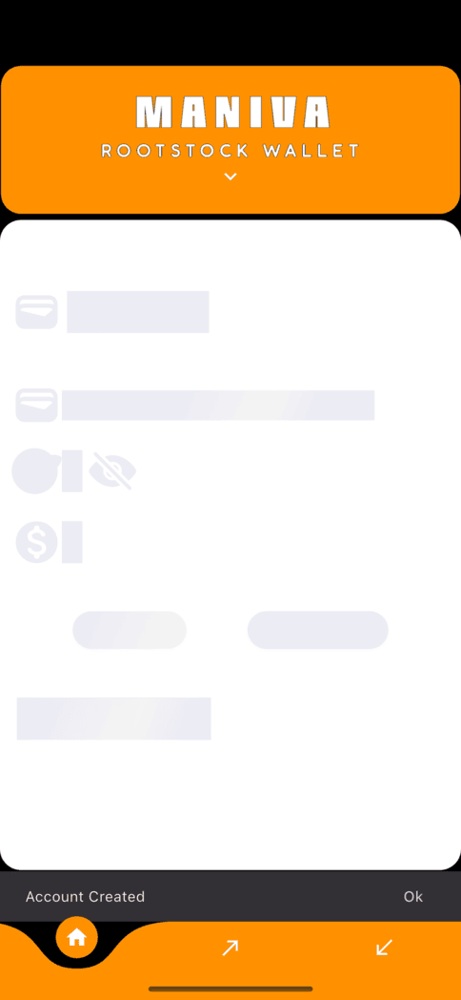
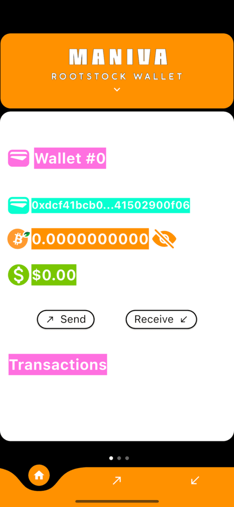

# my_rootstock_wallet

[](https://scorecard.dev/viewer/?uri=github.com/financial-bjbraz/rootstock_wallet)

[Releases](github.com/financial-bjbraz/rootstock_wallet/releases/latest)

## Attention this is an unofficial wallet that supports Rootstock accounts

Unofficial wallet that supports Rootstock accounts

## Getting Started

This is an open source project in flutter to create a crypto wallet compatible with Rootstock accounts.





### Generate launcher icon
``` dart run flutter_launcher_icons -f icons.yaml
```


## Building
```
rm -rf ./ios/Podfile.lock   
rm -rf .ios//Pods
flutter clean && flutter pub get && cd ios/ && pod install && cd ../

```

## Cleanning and generating dependencies
```
flutter clean && flutter pub get && dart run build_runner clean && dart run build_runner build --delete-conflicting-outputs && flutter gen-l10n
```
### Creating Bitcoin raw transaction
## List Unspent
```
./src/bitcoin-cli -regtest listunspent 1 99999999 '["bcrt1qf0vka0d60t9ua83k8mgf7p7uxa2xgsnetkrynv"]'
```
```
[
  {
    "txid": "1f9f332b64679eb2d1cff1fc730ded28c921b7e99e7a41041fd36856ccdc84b3",
    "vout": 0,
    "address": "bcrt1qf0vka0d60t9ua83k8mgf7p7uxa2xgsnetkrynv",
    "label": "",
    "scriptPubKey": "00144bd96ebdba7acbce9e363ed09f07dc3754644279",
    "amount": 50.00000000,
    "confirmations": 101,
    "spendable": true,
    "solvable": true,
    "desc": "wpkh([2dc798fa/84h/1h/0h/0/0]022aa947554dd848ef5eb414c1c763f1d31fc06233167c7b5c3302f4ee9613212c)#t7dj5dfp",
    "parent_descs": [
      "wpkh(tpubD6NzVbkrYhZ4WneTb2XQmFUmiXAjcAHEecZxrCY3zi5E6NtwyPwiLRgRmRhENfwzEkDmwKCi3wkD8kyP84nCwHEYoVhQXoPAnJHefZ1o4bN/84h/1h/0h/0/*)#jn6s08jj"
    ],
    "safe": true
  }
]
```


```
./src/bitcoin-cli -regtest createrawtransaction "[{\"txid\":\"a13abc39243912d54edcf7e0a128d2105449bbde464debd6eaff1a5e84661b2c\",\"vout\":0}]" "[{\"mfjKbRTeJMMsn9EY1Do9B4yj8qAYnA7P6p\":48.00}]"

```
02000000012c1b66845e1affead6eb4d46debb495410d228a1e0f7dc4ed512392439bc3aa10000000000fdffffff0100301a1e010000001976a9140256c57c9f26e7db4d04b2126880e8fa9176f15088ac00000000
```
./src/bitcoin-cli signrawtransaction 02000000012c1b66845e1affead6eb4d46debb495410d228a1e0f7dc4ed512392439bc3aa10000000000fdffffff0100301a1e010000001976a9140256c57c9f26e7db4d04b2126880e8fa9176f15088ac00000000

```